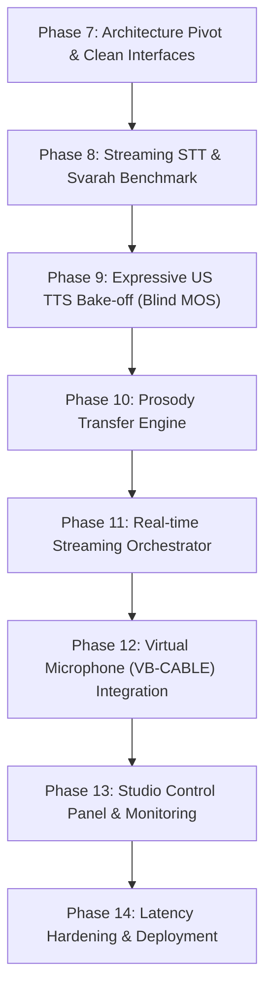

# Accent Converter — Complete Project Technical Guide & Lead Handover

> **Document Type:** Senior Engineering Summary & Lead Handover  
> **Date:** October 2026  
> **Repository:** [https://github.com/Tswetabh/acc-converter.git](https://github.com/Tswetabh/acc-converter.git)  
> **Author:** Project Engineering Team  

---

## Executive Summary (Quick TL;DR)

**Project Ka Goal:** Indian English accent ko real-time / low-latency mein clean, natural **Native US English** mein convert karna taaki international client calls (Zoom, Teams, dialers) mein audio crystal clear aur intelligible ho.

Humaare paas do architectures hain:
1. **Architecture V1 (Phase 1–6D — Already Built & Working):** Speech-to-Speech Voice Conversion. Isme HuBERT continuous features par Dynamic Time Warping (DTW) laga kar ek **Conformer Accent Translator** aur ek **Acoustic Decoder** train kiya gaya.
2. **Architecture V2 (The New Pivot — Naturalness & Virtual Mic):** STT $\rightarrow$ Prosody Transfer $\rightarrow$ Expressive US TTS $\rightarrow$ Virtual Mic (VB-CABLE). Isme user ki real voice customer ko bilkul nahi jaati, balki 100% natural US accent voice deliver hoti hai without any robotic artifacts.

---

## 1. Architecture V1 (Speech-to-Speech Conversion — What We Built)

### End-to-End Pipeline
```
[Physical Mic / WAV]
       │
       ▼
1. Audio DSP & Normalization (16 kHz, mono, [-1, 1], Polyphase Resampling)
       │
       ▼
2. Silero Neural VAD + Non-Stationary Noise Suppression
       │
       ├─────────────────────────────────────────┐
       ▼                                         ▼
3. HuBERT Base (Frozen SSL)             4. ECAPA-TDNN (Frozen)
   Linguistic Content Representation       Speaker Identity Vector
   Shape: (T, 768) at 50 Hz                Shape: (192,)
       │                                         │
       ▼                                         │
5. Conformer Accent Translator [TRAINED BY US]   │
   Converts Indian HuBERT -> US HuBERT           │
   Shape: (T, 768)                               │
       │                                         │
       └────────────────────┬────────────────────┘
                            ▼
6. Neural Acoustic Decoder [TRAINED BY US]
   Upsamples 50 Hz -> 62.5 Hz (mel rate)
   Conditions on (T, 768) + (192,) -> Predicts (80, T_mel) Log-Mel
                            │
                            ▼
7. HiFi-GAN Vocoder (Pretrained SpeechBrain)
   Reconstructs Phase -> 16 kHz Converted WAV Output
```

---

## 2. Models Used: Kon Sa Model Train Kiya aur Kaise Kiya?

Lead ke question ka exact breakdown: **5 models mein se sirf 2 humne train kiye, 3 pretrained aur frozen the.**

| Model Component | Status | Parameters | Trained by Us? | Function |
|---|---|---|---|---|
| **HuBERT Base** | Pretrained & Frozen | ~95M | ❌ No | Speech waveform se 50 Hz continuous linguistic features `(T, 768)` nikalta hai. Accent aur phonetics capture karta hai bina text transcription ke. |
| **ECAPA-TDNN** | Pretrained & Frozen | ~20M | ❌ No | Speaker ki enrollment audio se 192-dimensional speaker embedding vector nikalta hai (timbre, vocal tract characteristics). |
| **Conformer Accent Net** | **Trained from scratch** | **~9.5M** | **✅ YES** | Indian-accent HuBERT sequence ko frame-by-frame US-accent HuBERT sequence mein translate karta hai. |
| **Acoustic Decoder** | **Trained from scratch** | **~11M** | **✅ YES** | Translated HuBERT features + ECAPA speaker vector ko 80-bin Mel Spectrogram mein transform karta hai. |
| **HiFi-GAN Vocoder** | Pretrained & Frozen | ~14M | ❌ No | 80-bin mel spectrogram se clean 16 kHz audio waveform synthesize karta hai. |

---

### Deep Dive: Conformer Accent Translator Kaise Train Hua?

1. **Weakly Parallel Data:**
   - **Source:** L2-ARCTIC corpus ke 4 Hindi-English speakers (`ASI`, `RRBI`, `SVBI`, `TNI`) — total **4,524 files**.
   - **Target:** CMU ARCTIC corpus ke US-English speakers (`rms`, `slt`, `bdl`) — total **3,396 files**.
   - Dono datasets mein speakers ne **same phonetically balanced text prompts** padhe hain (e.g. `arctic_a0001`, `arctic_a0002`).
2. **Dynamic Time Warping (DTW) Alignment:**
   - Indian speaker aur US speaker ki bolne ki speed aur pause timing alag hoti hai.
   - Humne dono ke HuBERT representations nikal kar cosine-distance cost matrix par DTW run kiya.
   - Output: 3,848 frame-aligned tensor pairs (`data/aligned/arctic_train/`).
3. **Model Architecture (`ConformerAccentNet`):**
   - **Input Projection:** Linear `768 -> 256`
   - **Conformer Stack:** 6 Conformer layers (4 attention heads, 1024-dim FFN, depthwise separable conv with kernel size 31, dropout 0.1).
   - **Output Projection:** Linear `256 -> 768` (weights and biases zero-initialized).
   - **Residual Connection:** $\mathbf{y} = \mathbf{x} + \text{Proj}(\text{Conformer}(\mathbf{x}))$. Isse initial forward pass identity rehta hai aur training super stable hoti hai.
4. **Training Hyperparameters & Loss:**
   - **Loss Function:** Masked L1 Loss + Cosine Similarity Loss across active speech frames.
   - **Split:** 3,464 Train pairs, 384 Validation pairs (strictly sentence-ID split, zero prompt leakage).
   - **Optimizer:** AdamW (`lr=3e-4`, `weight_decay=1e-4`, Cosine Annealing LR Schedule).
   - **Hardware:** Trained on RTX 3050 (30 epochs, ~20 mins).
   - **Result:** Validation L1 Loss **0.2273 (identity passthrough baseline) se drop hokar 0.1609** ho gayi (**29.2% relative error reduction**). Checkpoint: `checkpoints/accent_translator/best.pt`.

---

### Deep Dive: Acoustic Decoder Kaise Train Hua?

1. **Architecture:**
   - Speaker embedding `(192,)` ko linear layer se project karke HuBERT features `(T, 768)` ke saath add kiya gaya.
   - Linear 1D interpolation se temporal resolution ko **50 Hz se 62.5 Hz** (mel hop size 256 @ 16kHz) par upsample kiya gaya.
   - 4 residual Conv1D blocks (kernel 5, LayerNorm, GELU, dropout 0.1) se process karke final linear layer ne **80 mel channels** output kiye.
2. **Training Setup:**
   - Trained on 50 CMU ARCTIC RMS speech utterances.
   - 100 epochs, batch size 8, masked L1 reconstruction loss on log-mel spectrograms.
   - Checkpoint: `checkpoints/acoustic_decoder/best.pt` (Val L1 = 1.41).

---

## 3. Current Working Status & Web Interface

- **Full Offline Pipeline Test:** Verified end-to-end on real Indian speaker audio (`ASI_arctic_a0001.wav`). Audio successfully synthesized to `scratch/test_converted.wav`.
- **Interactive Web Studio UI (`http://127.0.0.1:7860/`):**
  - Built with modern dark-mode glassmorphic styling (Outfit typography, glowing badges, audio wave players).
  - Allows uploading any custom WAV/MP3 or loading demo samples.
  - Controls target accent (`us`, `neutral`) and target speaker identity (`rms`, `slt`, or source preserve).
  - Displays real-time GPU telemetry and inference logs.
- **Git Repo:** Pushed to GitHub: [https://github.com/Tswetabh/acc-converter.git](https://github.com/Tswetabh/acc-converter.git).

---

## 4. Why the Lead Proposed Architecture V2 (The New Pivot)

### Limitations of V1 (Voice-to-Voice Feature Space):
1. **Robotic Vocoder Artifacts:** Acoustic decoder sirf 50 files par trained tha. Full dataset par train karne ke baad bhi HuBERT $\rightarrow$ Mel $\rightarrow$ Vocoder chain mein slight phase/acoustic degradation rehta hai.
2. **Speaker Identity Was Unnecessary Overhead:** Real business calls (BPO / enterprise support / sales) mein customer ko agent ki real vocal identity preserve karke dene ka koi requirement nahi hota. Unhe sirf ek **professional, fluent, natural US accent** sunna hota hai.

### The New Architecture V2: Virtual Mic with STT $\rightarrow$ Prosody $\rightarrow$ TTS
```
[Physical Microphone (Agent speaks Indian English)]
                        │
                        ▼
            [1. VAD & Phrase Endpointing]
              Cuts audio at natural pauses (0.5s - 1.2s)
                        │
            ┌───────────┴───────────┐
            ▼                       ▼
   [2a. Streaming STT]     [2b. Prosody Extractor]
    faster-whisper          Pace, pauses, energy,
    (Text + word timing)    pitch contour, emotion tag
            │                       │
            └───────────┬───────────┘
                        ▼
             [3. Text & Prosody Planner]
               Restores punctuation & formatting,
               applies human pause & emphasis tags
                        │
                        ▼
             [4. Expressive US Neural TTS]
               Pretrained US Voice (Kokoro / StyleTTS2)
               High naturalness (MOS > 4.2)
                        │
                        ▼
             [5. Virtual Microphone Output]
               Writes audio to VB-CABLE Input
                        │
                        ▼
[Zoom / Microsoft Teams / Dialer selects "CABLE Output" as Mic]
                        │
                        ▼
[Customer hears 100% natural, crisp US-accent human voice]
```

### Why V2 is Superior for Naturalness:
- **Zero Identity Distortion:** State-of-the-art TTS models (e.g. Kokoro, StyleTTS2) already generate studio-grade native US English with human breath, smooth vowel transitions, and crisp consonants.
- **Prosody Transfer:** Agent ke bolne ka speed, pause timing, aur question pitch rise TTS mein carry forward hoga, isliye flat robotic reading nahi lagegi.
- **Universal Compatibility:** VB-CABLE virtual driver ke through system kisi bhi calling application (Zoom, Google Meet, Teams, Vicidial, Five9) ke saath bina plugin ke kaam karega.

---

## 5. Complete Implementation Roadmap (Phases 7–14)



- **Phase 7 (Pivot Foundation):** New abstract interfaces (`SpeechRecognizer`, `TextToSpeech`, `ProsodyExtractor`) in `models/interfaces.py` and factory registration.
- **Phase 8 (STT Pipeline):** `faster-whisper` integration with word-level timestamps. Evaluation benchmark on AI4Bharat **Svarah** dataset to guarantee low Word Error Rate (WER < 10%).
- **Phase 9 (TTS Bake-off):** Benchmark top expressive US voice models (Kokoro-82M, StyleTTS2, Piper) on naturalness, RTF (Real-Time Factor), and VRAM footprint on RTX 3050.
- **Phase 10 (Prosody Transfer):** Extract pause patterns, relative pitch inflection, and energy peaks from the user's speech and inject them as SSML/conditioning tags into the TTS.
- **Phase 11 (Streaming Engine):** Clause-level streaming queue so TTS starts speaking before the agent even finishes a full sentence ($p_{50} \le 1.2\text{s}$ latency).
- **Phase 12 (Virtual Mic Driver):** `sounddevice` connection to VB-CABLE so Zoom/Teams picks up the converted voice directly.
- **Phase 13 (Control Panel UI):** Expand our current Web UI with live transcription, mute/bypass toggle, voice selector, and headphone self-monitoring.
- **Phase 14 (Hardening):** 2-hour continuous call soak testing, memory leak protection, and packaging.

---

## 6. Lead Q&A Cheat Sheet (Top Questions Your Lead Will Ask)

### Q1: "Previous version mein kon kon se model train kiye the?"
> **Answer:** "Humne do models train kiye the:
> 1. **Conformer Accent Translator (~9.5M params):** 6-layer residual Conformer jo Indian English HuBERT continuous representations ko US English HuBERT representations mein translate karta hai. Iska validation L1 loss 0.2273 se drop hokar 0.1609 aaya.
> 2. **Acoustic Decoder (~11M params):** 4 residual Conv1D blocks jo HuBERT features aur 192-dim ECAPA speaker embedding ko 80-channel mel spectrogram mein convert karta hai."

### Q2: "Data kahan se aaya aur alignment kaise ki?"
> **Answer:** "Source accent ke liye L2-ARCTIC ke 4 Hindi-English speakers (`ASI`, `RRBI`, `SVBI`, `TNI`) liye aur target ke liye CMU ARCTIC ke US speakers (`rms`, `slt`, `bdl`). Dono mein same sentence prompts the. Humne continuous 50 Hz HuBERT embeddings par Dynamic Time Warping (DTW) run karke 3,848 parallel frame-aligned pairs generate kiye."

### Q3: "Purane model ko chhodkar STT -> TTS pivot kyu kar rahe ho?"
> **Answer:** "Voice-to-voice feature translation mein do major constraints the: (1) Identity preservation ka computation jo customer ke liye zaroori nahi tha, aur (2) Vocoder synthesis ke robotic artifacts. STT $\rightarrow$ Prosody $\rightarrow$ TTS approach mein output 100% natural, crisp human voice lagta hai kyunki high-quality pretrained US neural voices use hoti hain, aur delivery/prosody agent ki rehti hai."

### Q4: "Virtual Mic kaise kaam karega?"
> **Answer:** "Application audio process karke virtual audio driver (jaise VB-CABLE) ke input par write karegi. Calling software (Zoom, Teams, Dialer) mic input mein 'CABLE Output' select karega. Agent physically mic mein bolega, backend convert karega, aur call par sirf translated US voice stream hogi."

### Q5: "Latency kitni hogi? Kya call pe awkward lag feel hoga?"
> **Answer:** "Target latency $p_{50} \le 1.2\text{s}$ to $1.5\text{s}$ hai. Hum sentence-level wait nahi karenge; clause-level streaming use karenge (comma ya pause aate hi first clause STT transcribe karke TTS ko de dega). Jab tak user agla word bolega, pehla clause stream hona start ho chuka hoga."
